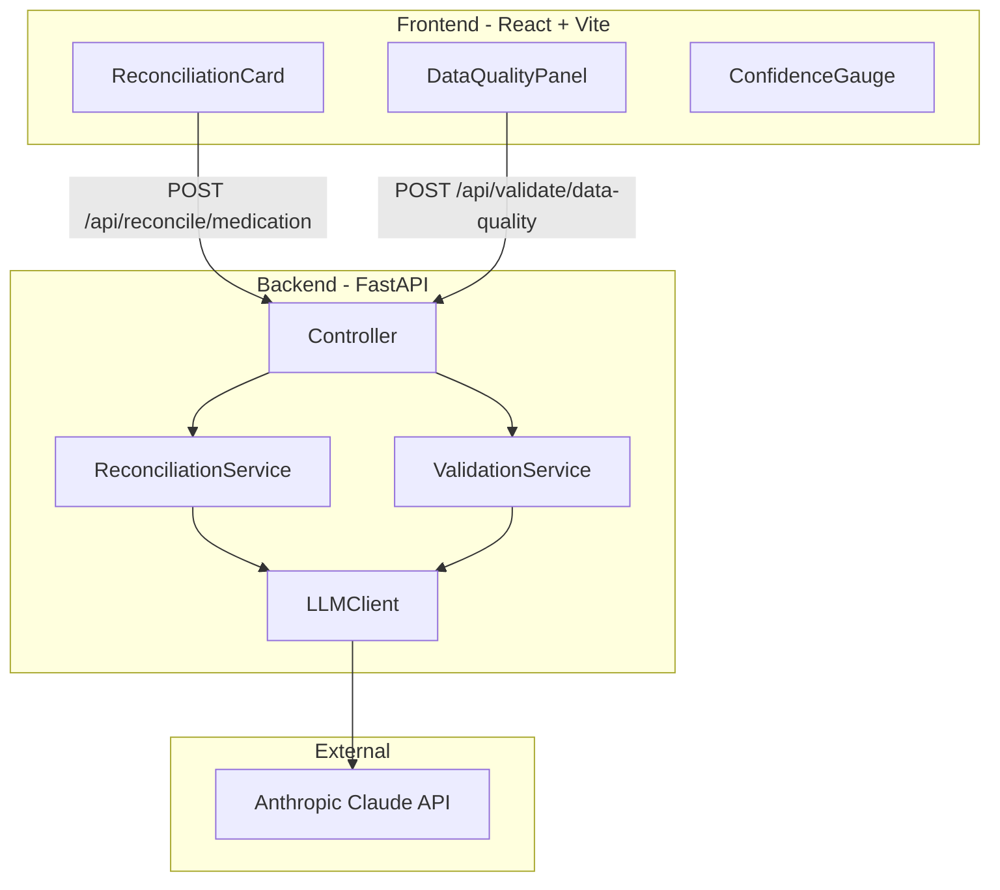

# Clinical Data Reconciliation Engine — Implementation Plan

 EHR Integration Intern Take-Home Assessment 

---

## Assignment Must-Haves (Checklist)

| Requirement | Plan Coverage |
|-------------|---------------|
| POST /api/reconcile/medication (input: patient_context + sources; output: reconciled_medication, confidence_score, reasoning, recommended_actions, clinical_safety_check) | Phase 1, 3 |
| POST /api/validate/data-quality (input: demographics, medications, allergies, conditions, vital_signs, last_updated; output: overall_score 0-100, breakdown, issues_detected) | Phase 1, 2, 3 |
| LLM for clinical reasoning + implausible data detection + human-readable explanations | Phase 3 |
| Prompts with clinical context; rate limits/errors; response caching | Phase 3 |
| Frontend: reconciliation results, data quality red/yellow/green, approve/reject, confidence + reasoning | Phase 4 |
| Clean modular architecture, input validation, error handling | Phases 1–3 |
| ≥5 unit tests covering core logic | Phase 2.4 |
| API key authentication | Phase 1.3 |
| README: run locally, LLM choice, design decisions, trade-offs, improvements, time spent | Phase 6 |

---

## Architecture Overview



---

## Phase 1: Project Scaffolding and Models

**Goal:** Establish project structure, Pydantic models, and basic API skeleton.

### 1.1 Project Structure

Create the directory tree as specified in the outline:

- `clinical-reconciliation/backend/` — FastAPI app, services, models, AI layer
- `clinical-reconciliation/backend/src/data/` — PyHealth adapter for test data (Patient/Event → Pydantic)
- `clinical-reconciliation/frontend/` — React + Vite app

### 1.2 Pydantic Models (`backend/src/models/`)

| Model | Purpose |
|-------|---------|
| `MedicationSource` | system, medication, last_updated, source_reliability, optional last_filled (for pharmacy) |
| `PatientContext` | age, conditions, recent_labs (e.g. eGFR) |
| `ReconcileRequest` | patient_context + sources (array of MedicationSource) |
| `ReconcileResponse` | reconciled_medication, confidence_score, reasoning, recommended_actions, clinical_safety_check |
| `DataQualityRequest` | demographics, medications, allergies, conditions, vital_signs, last_updated |
| `DataQualityResponse` | overall_score (0-100 int), breakdown (completeness, accuracy, timeliness, clinical_plausibility), issues_detected: [{field, issue, severity}] |

### 1.3 API Scaffolding

- FastAPI app in `backend/src/app.py`
- API key auth via `APIKeyHeader(name="x-api-key")` validated against `API_KEY` env var
- Two endpoints only (assignment limit): `POST /api/reconcile/medication` and `POST /api/validate/data-quality` — start with mock responses
- Structured error handling: 400, 401, 422, 429, 500

### 1.4 Environment

- `backend/.env.example` with `ANTHROPIC_API_KEY`, `API_KEY`
- `backend/requirements.txt`: fastapi, uvicorn, anthropic, pydantic, pyhealth

### 1.5 Test Data

Assignment provides an EHR Data link; if unavailable, use [PyHealth](https://pyhealth.readthedocs.io/en/latest/api/data.html) (`Event`, `Patient`) as the test data resource. Add `backend/src/data/` with an adapter mapping to Pydantic models. Include test data or examples in the GitHub submission per assignment guidelines.

---

## Phase 2: Deterministic Logic and Validation

**Goal:** Implement scoring, clinical rules, and unit tests before any LLM calls.

### 2.1 Source Scoring (`backend/src/utils/scoring.py`)

Pre-score medication sources before LLM:

| Signal | Weight | Logic |
|--------|--------|-------|
| Recency | 35% | Days since last_updated, normalized |
| Source reliability | 25% | high=1.0, medium=0.6, low=0.3 |
| Clinical alignment | 25% | e.g. low eGFR → flag high Metformin dose |
| Pharmacy fill | 15% | Recent fill = strong signal |

Send only top-scoring candidates to the LLM.

### 2.2 Clinical Rules (`backend/src/validators/clinical_rules.py`)

Rule-based checks for data quality:

- BP: systolic > 250 or diastolic > 150 → high severity (e.g. 340/180 per assignment example)
- Heart rate: > 250 or < 20 → high severity
- Age: < 0 or > 130 → invalid
- last_updated > 180 days → stale (medium; "Data is 7+ months old")
- allergies == [] → incomplete (medium; "No allergies documented - likely incomplete")

### 2.3 Confidence Calculator (`backend/src/utils/confidence.py`)

```python
def compute_confidence(recency_score, source_reliability, clinical_alignment, pharmacy_consistency):
    raw = recency*0.35 + source_reliability*0.25 + clinical_alignment*0.25 + pharmacy*0.15
    return round(min(max(raw, 0.0), 1.0), 2)
```

Document weight rationale in README.

### 2.4 Unit Tests (`backend/tests/test_core.py`)

**Assignment requirement: At least 5 unit tests covering core logic.** Use PyHealth fixtures or assignment-provided EHR data.

| Test | Coverage |
|------|----------|
| `test_reconciliation_prefers_recent_source` | Scoring prefers newer last_updated |
| `test_implausible_blood_pressure_detected` | 340/180 → high severity |
| `test_confidence_score_clamped_to_bounds` | Score in [0, 1] |
| `test_missing_allergies_flagged` | Empty allergies → medium severity |
| `test_api_rejects_missing_key` | 401 without x-api-key |
| `test_llm_response_parser_handles_malformed_json` | Parser fallback |

---

## Phase 3: AI Integration

**Goal:** Wire Anthropic Claude for reconciliation and data-quality plausibility checks.

### 3.1 LLM Client (`backend/src/ai/llm_client.py`)

- Thin wrapper around Anthropic Python SDK
- Retry with exponential backoff on RateLimitError
- In-memory cache keyed on `hash(input_json)`
- Timeout handling

### 3.2 Prompts (`backend/src/ai/prompts.py`)

**Reconciliation:** System + user prompt with patient context and top candidates. Output: JSON with reconciled_medication, confidence_score, reasoning, recommended_actions, clinical_safety_check.

**Data quality:** Send only flagged fields to LLM; ask "Is [field: value] clinically plausible for [conditions]?" to minimize tokens.

**Document prompt engineering approach** in README (assignment requirement).

### 3.3 Response Parser (`backend/src/ai/response_parser.py`)

- Strip markdown fences if present
- `json.loads()` with try/catch
- Validate parsed object against Pydantic output model
- Fallback to deterministic result if malformed

### 3.4 Service Layer

- `ReconciliationService`: score_sources → LLM → confidence → ReconcileResponse
- `ValidationService`: rule-based checks → LLM on flagged fields → DataQualityResponse

---

## Phase 4: Frontend Dashboard

**Goal:** React UI for reconciliation and data quality. Assignment: "Keep it simple - focus on clarity over design complexity."

### 4.1 Stack

- React + Vite
- Axios (`frontend/src/api/client.js`)
- shadcn/ui (cards, badges, progress bars)
- Recharts (confidence gauge, quality bar chart)

### 4.2 Components

| Component | Responsibility |
|-----------|----------------|
| `ReconciliationCard` | Input form, reconciled output, confidence badge (red/yellow/green), expandable reasoning, **Approve/Reject** (assignment requirement) |
| `DataQualityPanel` | Data quality scores with **visual indicators (red/yellow/green)** (assignment requirement), 4 sub-dimension bars, issues list |
| `ConfidenceGauge` | Visualize confidence scores and reasoning (assignment requirement) |

### 4.3 Data Quality Scoring Dimensions

- Completeness (60%): fields present and non-empty
- Accuracy (50%): plausible ranges
- Timeliness (70%): recency of record
- Clinical Plausibility (40%): values make sense together

---

## Phase 5: Docker and Integration

### 5.1 Backend Dockerfile

- Base: `python:3.11-slim`
- Install deps, copy src, CMD uvicorn on port 8000

### 5.2 docker-compose.yml

- Wire backend + frontend with env vars
- Ensure frontend can reach backend API

---

## Phase 6: Documentation and Finalization

### 6.1 README (Assignment Requirements)

README **must** include:

1. **How to run the application locally** — pip install, env vars, uvicorn, npm run dev
2. **Which LLM API you used and why** — Anthropic Claude
3. **Key design decisions and trade-offs** — hybrid deterministic+LLM, in-memory cache, rule-first
4. **What you'd improve with more time** — FHIR R4, Redis, streaming, drug-disease DB
5. **Estimated time spent**
6. Architecture diagram (Frontend → FastAPI → Engine → LLM)
7. Prompt engineering approach (documented per assignment)
8. Brief architecture decisions document (why certain approaches were chosen)

### 6.2 Submission

- GitHub repository with all source code, README, architecture decisions, test data or examples
- Optional: 2–3 min video demo (walkthrough + one technical decision you're proud of)

### 6.3 Bonus Points (Optional)

- Confidence score calibration based on multiple factors
- Duplicate record detection algorithm
- Webhook support for real-time updates
- Docker containerization
- Simple deployment (Vercel, Railway, etc.)

---

## Key Files Reference

| Path | Purpose |
|------|---------|
| `backend/src/app.py` | FastAPI app, routes, auth |
| `backend/src/data/pyhealth_adapter.py` | PyHealth Patient/Event → Pydantic models |
| `backend/src/services/reconciliation_service.py` | Reconciliation pipeline |
| `backend/src/services/validation_service.py` | Data quality pipeline |
| `backend/src/ai/llm_client.py` | Anthropic wrapper + cache |
| `backend/src/ai/prompts.py` | Prompt templates |
| `backend/src/ai/response_parser.py` | JSON parse + validate |
| `backend/src/utils/scoring.py` | Deterministic source scoring |
| `backend/src/utils/confidence.py` | Confidence calibration |
| `backend/src/validators/clinical_rules.py` | Rule-based checks |
| `frontend/src/components/ReconciliationCard.jsx` | Main reconciliation UI |
| `frontend/src/components/DataQualityPanel.jsx` | Data quality UI |
| `frontend/src/components/ConfidenceGauge.jsx` | Confidence visualization |

---

## Build Order Summary

1. Models, app scaffold, auth, mock routes
2. PyHealth/EHR data adapter (if using PyHealth; otherwise use assignment-provided data)
3. Scoring, clinical rules, confidence util, unit tests (≥5)
4. LLM client, prompts, parser, service integration
5. Frontend components (ReconciliationCard, DataQualityPanel, ConfidenceGauge)
6. Docker (bonus), wire frontend ↔ backend
7. README (all required sections), cleanup, final testing
