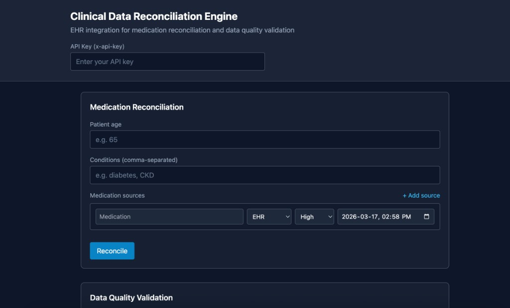
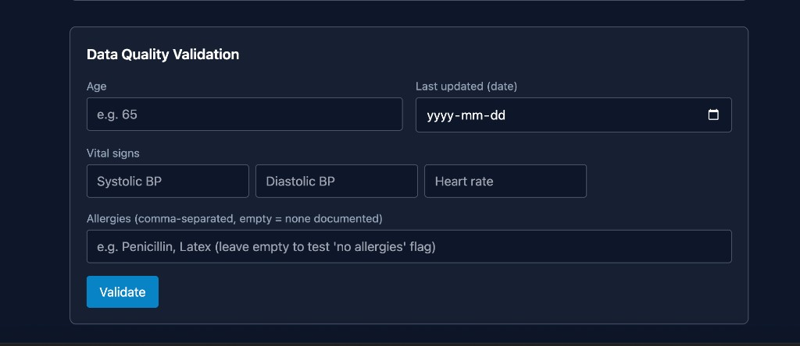
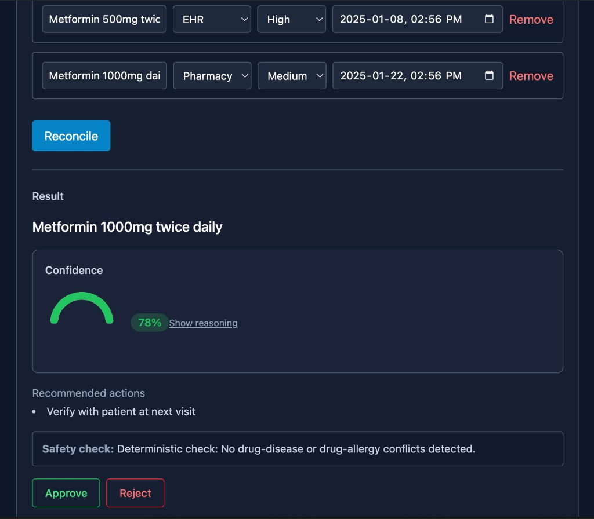
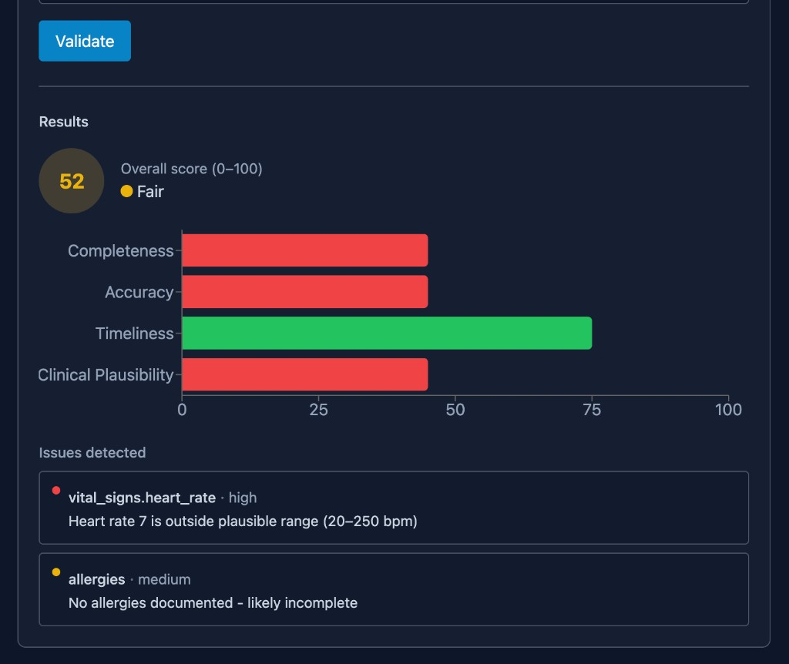

# Clinical Data Reconciliation Engine

EHR integration for medication reconciliation and data quality validation. Built for the Full Stack Developer - EHR Integration Intern Take-Home Assessment.

---

## Screenshots

### Application Overview

**Top of page** — Header, API key input, and Medication Reconciliation section with patient age, conditions, and medication sources.



**Bottom of page** — Data Quality Validation form with age, last updated date, vital signs (systolic/diastolic BP, heart rate), and allergies.



### Medication Reconciliation

Reconcile conflicting medication entries from EHR and pharmacy. The system proposes a reconciled medication, confidence score, reasoning, recommended actions, and clinical safety checks. Approve or reject the result.



### Data Quality Validation

Validate patient data across completeness, accuracy, timeliness, and clinical plausibility. View overall score (0–100), dimension breakdown, and detected issues with severity.



---

## How to Run Locally

### Prerequisites

- Python 3.11+
- Node.js 18+
- [Anthropic API key](https://console.anthropic.com/) for LLM features

### Backend

```bash
cd backend
python -m venv .venv
source .venv/bin/activate   # On Windows: .venv\Scripts\activate
pip install -r requirements.txt
```

Copy `.env.example` to `.env` and set:

```
API_KEY=your-api-key-here
ANTHROPIC_API_KEY=your-anthropic-api-key
```

Run the server:

```bash
uvicorn src.app:app --reload --host 0.0.0.0 --port 8000
```

Or use the entry point:

```bash
python main.py
```

API docs: http://localhost:8000/docs

### Frontend

```bash
cd frontend
npm install
npm run dev
```

Frontend: http://localhost:5173 — Vite proxies `/api` to the backend.

### Docker

```bash
# From repo root; ensure backend/.env exists with API_KEY and ANTHROPIC_API_KEY
# Docker reads .env from project root — create symlink if needed: ln -sf backend/.env .env
docker compose up --build
```

- Frontend: http://localhost:5173  
- Backend: http://localhost:8000

---

## LLM API: Anthropic Claude

**Which LLM:** Anthropic Claude (Sonnet 4, `claude-sonnet-4-20250514` by default).

**Why:** Strong at structured reasoning, JSON output, and clinical-style tasks. The assignment suggested LLM for clinical reasoning and human-readable explanations; Claude fits well. Override via `ANTHROPIC_MODEL` (e.g. `claude-sonnet-4-6`) if needed.

---

## Architecture

```
┌─────────────────────────────────────────────────────────────────┐
│  Frontend (React + Vite)                                         │
│  ReconciliationCard │ DataQualityPanel │ ConfidenceGauge         │
└────────────────────────────┬────────────────────────────────────┘
                             │ POST /api/reconcile/medication
                             │ POST /api/validate/data-quality
                             │ (x-api-key header)
                             ▼
┌─────────────────────────────────────────────────────────────────┐
│  Backend (FastAPI)                                               │
│  Controller → ReconciliationService / ValidationService           │
└────────────────────────────┬────────────────────────────────────┘
                             │
         ┌───────────────────┼───────────────────┐
         ▼                   ▼                   ▼
┌─────────────────┐ ┌──────────────┐ ┌─────────────────────────┐
│ Scoring         │ │ Clinical     │ │ LLM Client (Anthropic)     │
│ Confidence      │ │ Rules        │ │ Prompts │ Response Parser  │
└─────────────────┘ └──────────────┘ └────────────┬─────────────┘
                                                   │
                                                   ▼
                                    ┌─────────────────────────────┐
                                    │  Anthropic Claude API       │
                                    └─────────────────────────────┘
```

---

## Key Design Decisions and Trade-offs

| Decision | Rationale | Trade-off |
|----------|-----------|-----------|
| **Hybrid deterministic + LLM** | Rule-based checks run first (BP, HR, age, allergies, staleness). LLM used only for plausibility and reconciliation. | Reduces token use and latency; rules may miss edge cases the LLM could catch. |
| **In-memory cache** | Cache LLM responses by `hash(input_json)` to avoid duplicate calls. | Simple, no Redis; cache lost on restart; not shared across instances. |
| **Rule-first validation** | Clinical rules flag issues; LLM only reviews flagged fields. | Fewer tokens, faster; LLM does not see full context unless needed. |
| **JSON-only LLM output** | Prompts request raw JSON, no markdown fences. Parser strips fences if present. | Easier parsing; some models occasionally add markdown. |
| **API key auth** | `x-api-key` header validated against `API_KEY` env var. | Simple; no OAuth/JWT; suitable for internal or demo use. |

---

## Prompt Engineering Approach

1. **System prompt** — Defines role (e.g. clinical pharmacist), constraints, and exact JSON keys.
2. **User prompt** — Structured patient context and source data; minimal free text.
3. **JSON-only output** — Explicit “Output raw JSON only. Do not include markdown or code fences.”
4. **Data quality** — Only flagged fields sent to the LLM to minimize tokens.
5. **Batch plausibility** — Multiple flagged fields in one prompt when possible.

See `backend/src/ai/prompts.py` for templates.

---

## Confidence Score Weights

| Factor | Weight | Rationale |
|--------|--------|-----------|
| Recency | 35% | Medication lists change often; newer data preferred. |
| Source reliability | 25% | EHR vs pharmacy vs patient-reported. |
| Clinical alignment | 25% | e.g. eGFR and Metformin dosing. |
| Pharmacy consistency | 15% | Recent fill supports adherence. |

Raw score clamped to [0, 1]. See `backend/src/utils/confidence.py`.

---

## What I'd Improve With More Time

- **FHIR R4** — Use FHIR resources instead of custom Pydantic models for interoperability.
- **Redis cache** — Shared, persistent LLM cache across instances.
- **Streaming** — Stream LLM responses for better perceived latency.
- **Drug–disease DB** — Integrate a drug–disease/allergy knowledge base for deterministic safety checks.
- **Duplicate detection** — Algorithm to detect duplicate or near-duplicate records.
- **Webhooks** — Real-time updates when source systems change.
- **Deployment** — Deploy to Vercel (frontend) + Railway/Render (backend).

---

## Estimated Time Spent

| Phase | Time |
|-------|------|
| Phase 1: Scaffolding, models, API | ~1–2 h |
| Phase 2: Scoring, rules, confidence, tests | ~1–2 h |
| Phase 3: LLM integration, prompts, services | ~1–2 h |
| Phase 4: Frontend dashboard | ~1–2 h |
| Phase 5: Docker | ~1 h |
| Phase 6: Documentation | ~1–2 h |
| **Total** | **~6–11 h** |

---

## Architecture Decisions

See [docs/ARCHITECTURE.md](docs/ARCHITECTURE.md) for a brief rationale of key technical choices (hybrid deterministic+LLM, in-memory cache, rule-first validation, etc.).

---

## Project Structure

| Path | Purpose |
|------|---------|
| `backend/src/app.py` | FastAPI app, routes, auth |
| `backend/src/services/reconciliation_service.py` | Reconciliation pipeline |
| `backend/src/services/validation_service.py` | Data quality pipeline |
| `backend/src/ai/llm_client.py` | Anthropic wrapper, cache, retry |
| `backend/src/ai/prompts.py` | Prompt templates |
| `backend/src/ai/response_parser.py` | JSON parse + validate |
| `backend/src/utils/scoring.py` | Source scoring |
| `backend/src/utils/confidence.py` | Confidence calculation |
| `backend/src/validators/clinical_rules.py` | Rule-based checks |
| `frontend/src/components/ReconciliationCard.jsx` | Reconciliation UI |
| `frontend/src/components/DataQualityPanel.jsx` | Data quality UI |
| `frontend/src/components/ConfidenceGauge.jsx` | Confidence visualization |

---

## Running Tests

```bash
cd backend
API_KEY=test-key .venv/bin/pytest tests/ -v
```

Requires `API_KEY` for the auth test. No `ANTHROPIC_API_KEY` needed (tests use mocks).

---

## License

MIT (or as specified by the assignment).
